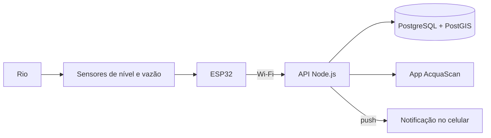

# AcquaScan · Supernova SEBRAE

> Monitoramento dos rios de Petrópolis com sensores de baixo custo e alertas no celular, rua a rua.

Este repositório registra **todo o desenvolvimento do AcquaScan** para a apresentação no evento científico **Supernova, do SEBRAE**. Aqui ficam o problema que motivou o projeto, a solução proposta, o modelo de negócio, as decisões técnicas, as evidências de validação e o material do evento.

O código não fica aqui. Ele está nos repositórios técnicos listados em [Repositórios do projeto](#repositórios-do-projeto).

> **Status:** em desenvolvimento. O firmware de medição de vazão está em validação, a stack do aplicativo foi definida e o sensor de nível é o próximo passo do hardware.

---

## O problema

Petrópolis é uma cidade serrana cortada por rios estreitos, com casas, ruas e comércio construídos nas margens e nas encostas. Em chuvas fortes, o nível dos rios sobe em pouco tempo, e quem mora perto deles muitas vezes não sabe se a sua rua está em risco até a água chegar.

Contexto completo e fontes: [docs/01-problema/contexto-petropolis.md](docs/01-problema/contexto-petropolis.md).

## A solução

Estações com um **ESP32** e sensores instaladas nos rios medem o **nível da água** (e a vazão) e enviam os dados pela internet. Um **aplicativo** mostra, num mapa de Petrópolis, o nível de cada rio em %, o estado (estável, atenção, crítico) e uma estimativa de como ele vai evoluir. O usuário pesquisa a própria rua, recebe **notificações** quando o risco aumenta e encontra os **pontos de apoio** mais próximos.



Visão geral das funcionalidades: [docs/02-solucao/visao-geral.md](docs/02-solucao/visao-geral.md).

---

## Status do projeto

| Frente | Situação | Detalhe |
|---|---|---|
| Firmware de vazão (v0.1.0) | Em validação | Compilação e simulação aprovadas; falta validar toda a faixa de vazão |
| Sensor de nível | A fazer | Pré-requisito para exibir o nível do rio em % ([decisão 002](docs/decisoes/002-sensor-de-nivel.md)) |
| Envio de dados via Wi-Fi | A fazer | Previsto na v0.6.0 do firmware |
| Aplicativo | Stack definida | Repositório a criar ([decisão 001](docs/decisoes/001-stack-do-aplicativo.md)) |
| Pesquisa com usuários | A fazer | Roteiro pronto em [pesquisa-usuarios.md](docs/01-problema/pesquisa-usuarios.md) |
| Modelo de negócio | Rascunho | [business-model-canvas.md](docs/03-negocio/business-model-canvas.md) |
| Material do evento | A fazer | [evento/](evento/) |

O histórico de marcos está no [CHANGELOG.md](CHANGELOG.md) e o dia a dia da equipe no [diário de bordo](diario-de-bordo/).

---

## Repositórios do projeto

| Repositório | Conteúdo | Situação |
|---|---|---|
| **acquascan-supernova** (este) | Documentação, negócio, diário de bordo e evento | Ativo |
| [Monitoramento-Fluxo-de-Água-ESP32](https://github.com/Tidxlz/Monitoramento-Fluxo-de--gua-ESP32) | Firmware do ESP32, simulação no Wokwi, calibração | Ativo |
| acquascan-app | API (Node.js), banco (PostgreSQL) e aplicativo (React Native) | A criar |

A divisão em três repositórios está explicada na [decisão 003](docs/decisoes/003-estrutura-dos-repositorios.md).

---

## Navegue pela documentação

| Pasta | O que tem | Para quem |
|---|---|---|
| [docs/01-problema/](docs/01-problema/) | Contexto de Petrópolis e pesquisa com moradores | Quem quer entender **por que** o projeto existe |
| [docs/02-solucao/](docs/02-solucao/) | Funcionalidades, arquitetura e mapa mental do app | Quem quer entender **o que** o projeto faz |
| [docs/03-negocio/](docs/03-negocio/) | Canvas, público, parceiros, concorrentes e custos | Quem avalia a **viabilidade** |
| [docs/04-tecnico/](docs/04-tecnico/) | Resumo do hardware e do aplicativo | Quem quer entender **como** funciona |
| [docs/05-validacao/](docs/05-validacao/) | Testes e resultados de todas as frentes | Quem quer **provas** de que funciona |
| [docs/decisoes/](docs/decisoes/) | Registro de decisões (ADRs) | Quem pergunta "por que vocês escolheram isso?" |
| [diario-de-bordo/](diario-de-bordo/) | Uma entrada por encontro da equipe | Quem quer ver o **processo** |
| [evento/](evento/) | Pitch, banner, roteiro da demonstração e FAQ da banca | A equipe, na preparação para a Supernova |
| [midia/](midia/) | Identidade visual, fotos e vídeos | Quem produz o material visual |

Outros arquivos: [equipe.md](equipe.md) e [referencias.md](referencias.md).

---

## Como manter este repositório

**A cada encontro da equipe**, crie uma entrada no diário de bordo copiando o [modelo](diario-de-bordo/modelo.md). Leva cinco minutos e é a melhor prova do processo no dia do evento.

**A cada decisão importante** (trocar um sensor, mudar uma tela, escolher um parceiro), registre um ADR em `docs/decisoes/`, seguindo o [formato](docs/decisoes/README.md).

**A cada marco concluído**, atualize a tabela de status acima e a seção **Não lançado** do [CHANGELOG.md](CHANGELOG.md).

**Mensagens de commit** começam pela área alterada, para o histórico ficar fácil de ler:

```
diario: encontro de 14/10
docs: adiciona entrevistas com moradores do Centro
negocio: atualiza custos da estação
evento: primeira versão do roteiro do pitch
decisao: 004 escolha da alimentação solar
```

**Marcadores `[PREENCHER]`** indicam informações que a equipe precisa completar. Para encontrar todos: pesquise `[PREENCHER]` no VS Code (`Ctrl+Shift+F`).

---

## Equipe

Integrantes, papéis e contatos em [equipe.md](equipe.md).

## Licença

[PREENCHER] Definir a licença da documentação. Sugestão: [CC BY 4.0](https://creativecommons.org/licenses/by/4.0/deed.pt-br), que permite reutilizar o material citando a equipe. O firmware já usa a licença MIT.
