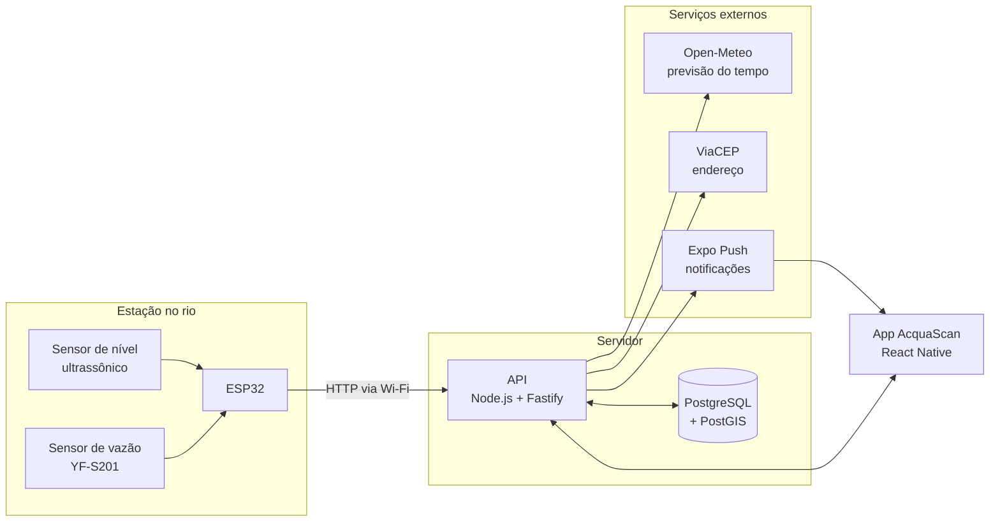

# Arquitetura

## Visão geral



## Componentes

| Componente | Responsabilidade | Onde está o código |
|---|---|---|
| Estação | Medir nível e vazão e enviar as leituras a cada minuto | [Repositório do firmware](https://github.com/Tidxlz/Monitoramento-Fluxo-de--gua-ESP32) |
| API | Receber leituras, calcular estado, enviar alertas, servir o app | acquascan-app (a criar) |
| Banco | Guardar estações, leituras, ruas, pontos de apoio e usuários | acquascan-app (a criar) |
| App | Mapa, pesquisa por rua, previsão, pontos de apoio e notificações | acquascan-app (a criar) |

## Fluxo de uma medição

1. O ESP32 mede a distância até a superfície da água e a vazão.
2. A cada minuto, envia as leituras para a API, identificando-se com um token próprio da estação.
3. A API converte a distância em nível, calcula o nível em % e o estado, e salva a leitura.
4. Se o estado mudou para pior, a API envia uma notificação a todos os usuários cuja região é atendida por aquela estação.
5. O app consulta a API periodicamente e atualiza o mapa.

## Regras de cálculo

```
nível (cm)   = altura de instalação do sensor − distância medida até a água
nível (%)    = nível ÷ nível de transbordamento × 100
estado       = estável | atenção | crítico   (limites em % definidos por estação)
estimativa   = (nível de transbordamento − nível atual) ÷ velocidade de subida
vazão (L/s)  = vazão (L/min) ÷ 60
```

Os limites de cada estado devem ser definidos com base no histórico do rio e, se possível, em conversa com a Defesa Civil. Valores iniciais sugeridos para o protótipo: estável abaixo de 50%, atenção de 50% a 80%, crítico acima de 80%.

## Pesquisa por rua

As ruas de Petrópolis são importadas do OpenStreetMap para o PostGIS. Cada rua é associada à estação mais próxima no rio que passa por ela. Assim, a pesquisa é uma consulta ao próprio banco, sem depender de serviços externos a cada busca.
