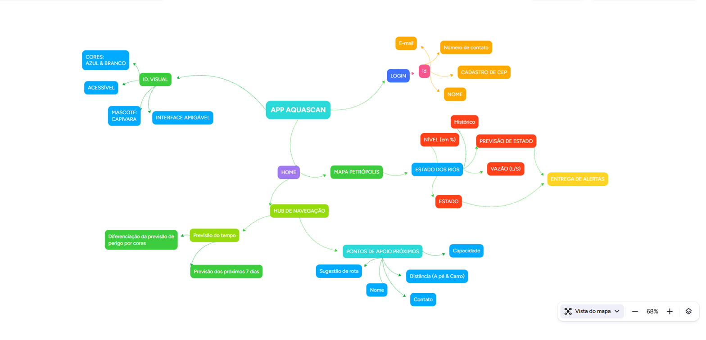

# Visão geral da solução

O AcquaScan tem duas partes: **estações de monitoramento** instaladas nos rios e um **aplicativo** que transforma as medições em informação útil para o morador.

## Funcionalidades do aplicativo

Organizadas a partir do mapa mental. A coluna **Versão** separa o que entra no primeiro protótipo (MVP) do que fica para depois.

| Área | Funcionalidade | Versão |
|---|---|---|
| **Cadastro e login** | Nome, e-mail, número de contato e CEP | MVP |
| **Mapa de Petrópolis** | Rios e estações de monitoramento no mapa | MVP |
| | Pesquisa do estado do rio por rua | MVP |
| **Estado dos rios** | Nível em % | MVP |
| | Estado (estável, atenção, crítico) | MVP |
| | Vazão (L/s) | Futuro |
| | Histórico de medições | MVP |
| | Estimativa de evolução do estado | Futuro |
| **Alertas** | Notificação quando o estado muda na região do usuário | MVP |
| **Previsão do tempo** | Próximos 7 dias | MVP |
| | Cores de acordo com o nível de perigo | MVP |
| **Pontos de apoio** | Nome, capacidade e contato | MVP |
| | Distância a pé e de carro | Futuro |
| | Sugestão de rota (abre Google Maps ou Waze) | MVP |
| **Identidade visual** | Azul e branco, acessível, mascote capivara | MVP |

## Como o morador usa o app

1. Faz o cadastro informando o CEP. O app passa a saber qual é a região dele.
2. Abre o mapa e vê os rios da cidade coloridos pelo estado.
3. Pesquisa a própria rua e vê o nível do rio mais próximo e o histórico das últimas horas.
4. Quando o estado do rio da sua região muda para **atenção** ou **crítico**, recebe uma notificação.
5. Em uma emergência, abre **Pontos de apoio**, vê o mais próximo e toca em **Como chegar**.

## O que o AcquaScan não faz

Para manter a credibilidade com a banca e com os usuários:

- **Não substitui a Defesa Civil.** Os alertas oficiais continuam sendo a referência para evacuação.
- **Não prevê o futuro com certeza.** A estimativa de evolução supõe que o rio continue subindo no ritmo atual; uma mudança na chuva muda a estimativa.
- **Não cobre trechos sem estação.** A pesquisa por rua indica a estação mais próxima e a distância até ela.

Detalhes técnicos: [arquitetura.md](arquitetura.md).
